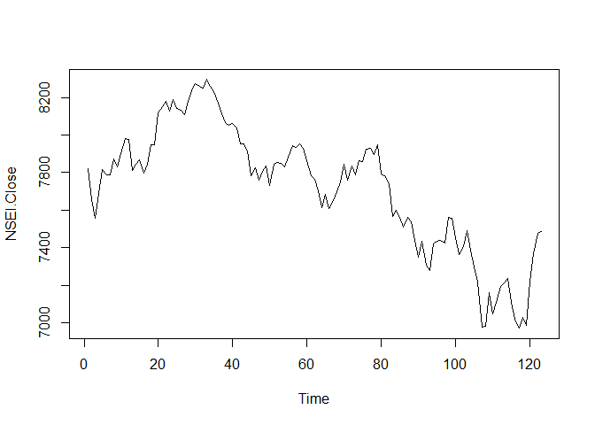
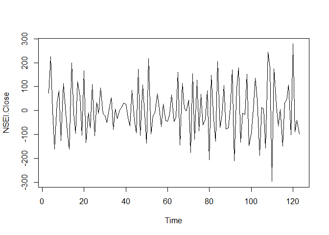
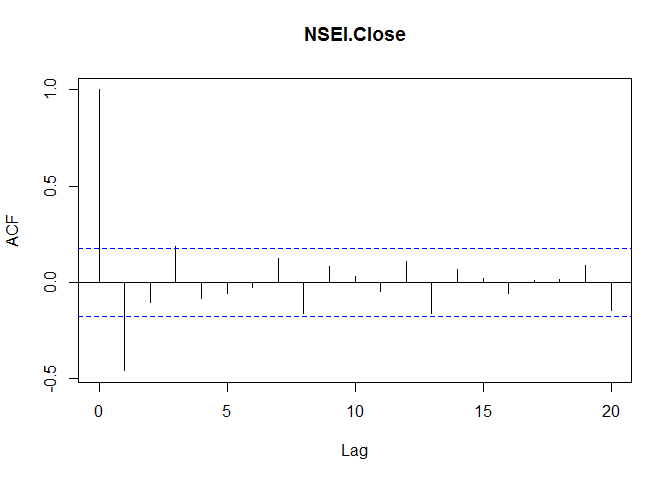
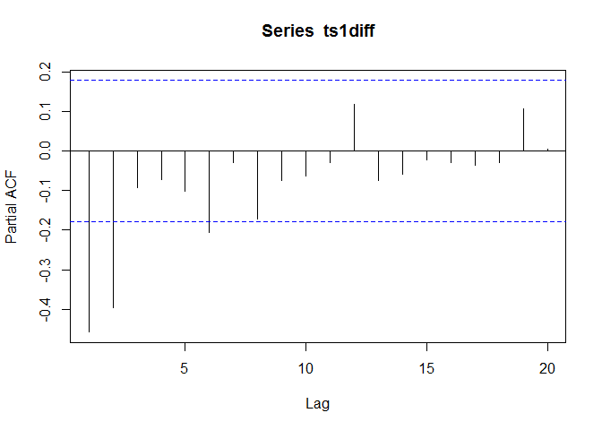
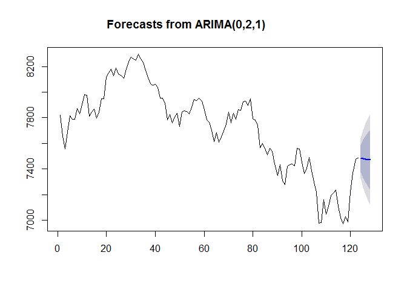

# Predicting CNX Nifty Index for 14th March,2016
Shubhankar Gupta  
March 8, 2016  

I have used an ARIMA model to do the time series analysis and predicting the required value.

Loading the data from Yahoo finance for CNX Nifty from 3rd September,2015 to 4th March,2016

```r
suppressWarnings(suppressMessages(library(quantmod)))
from.dat = as.Date("09/03/15", format= "%m/%d/%y")
to.dat = as.Date("03/04/16", format= "%m/%d/%y")
suppressWarnings(suppressMessages(getSymbols("^NSEI",src = "yahoo", from= from.dat, to= to.dat)))
```

```
## [1] "NSEI"
```

```r
head(NSEI,2)
```

```
##            NSEI.Open NSEI.High NSEI.Low NSEI.Close NSEI.Volume
## 2015-09-03   7774.45    7845.6  7754.05    7823.00      155800
## 2015-09-04   7803.40    7804.9  7626.85    7655.05      193600
##            NSEI.Adjusted
## 2015-09-03       7823.00
## 2015-09-04       7655.05
```

Using Only Closing Value for our Analysis.

```r
nseiclose = Cl(NSEI)
```

Converting NSEI into time series class. I further used a difference form of the time series in order to obtain the autocorrelation.  

```r
ts1 = ts(nseiclose,frequency = 1)
plot(ts1)
```



```r
ts1diff = diff(ts1,differences = 2)
plot.ts(ts1diff)
```



I plotted the autocorrelation and partial autocorrelation funtion.

```r
acf(ts1diff,lag.max = 20)
```



```r
pacf(ts1diff,lag.max = 20)
```


Since the correlogram tails off to zero after lag 3, and the partial correlogram is zero after lag 2, the following ARMA models are possible for the time series:

- an ARMA(2,0) model, since the partial autocorrelogram is zero after lag 2, and the correlogram tails off to zero after lag 3, and the partial correlogram is zero after lag 2.
- an ARMA(0,1) model, since the autocorrelogram is zero after lag 1, and the partial correlogram tails off to zero.
The ARMA(2,0) model has 2 parameters, the ARMA(0,1) model has 1 parameters. Using principle of parsimony we select ARMA(0,1) and thus ARIMA(0,2,1), since d=2.  

```r
suppressMessages(suppressWarnings(library(forecast)))
fcastarima = arima(ts1,order = c(0,2,1))
fcastarimaforecast = forecast.Arima(fcastarima,h=5)
plot(fcastarimaforecast)
```



```r
fcastarimaforecast
```

```
##     Point Forecast    Lo 80    Hi 80    Lo 95    Hi 95
## 124       7482.583 7379.208 7585.958 7324.484 7640.681
## 125       7479.815 7333.028 7626.603 7255.323 7704.307
## 126       7477.048 7296.547 7657.549 7200.996 7753.100
## 127       7474.280 7265.024 7683.537 7154.250 7794.310
## 128       7471.513 7236.631 7706.395 7112.291 7830.734
```
Last forecast corresponds to the prediction for 14th March.
